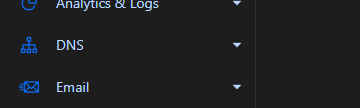
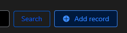
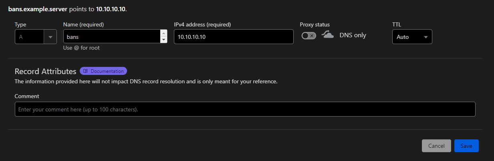
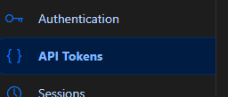
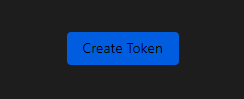
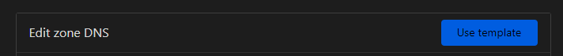
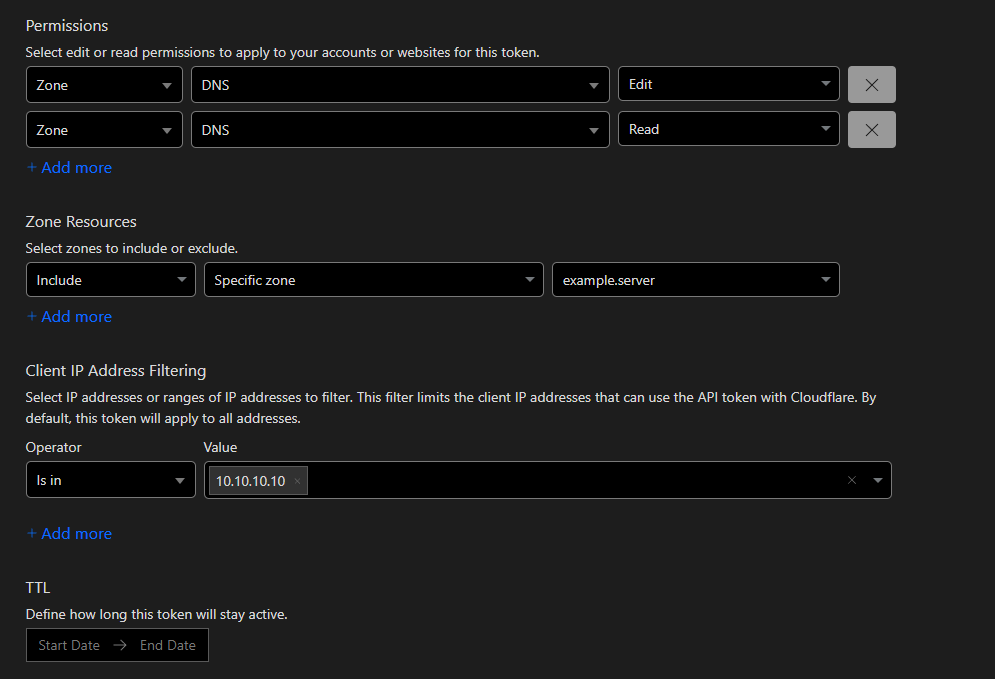
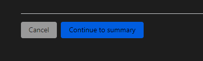
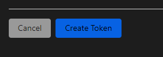
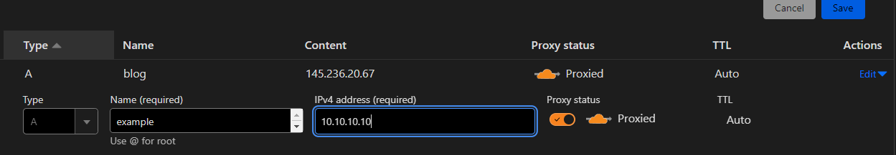

# Reverse Proxy setup with Caddy
This page explains how to set up the web interface with a reverse proxy like [Caddy](https://caddyserver.com/), for
TLS and security.

You'll need:
- A domain to use with the web interface.
- A server running a newer version of Linux. In this guide we'll use the `apt` package manager, but you are free to use your own.
- A running instance of the LibertyBans-Web interface. Do note, that in order for this to work, you'll have to have the reverse proxy
access the running instance in a way or another. Double-check your network setup if this is possible. For help, consider joining the official discord support [here](https://discord.gg/qgQbJMkcQw).

In this guide we'll cover an installation that is behind [Cloudflare](https://www.cloudflare.com/)'s DDoS protection system. If you do not use Cloudflare, or do not want to,
you are free to skip certain steps. In the guide, it will be noted where these steps are.
## Caddy installation

First, please install Caddy, a secure web server with automatic TLS prevision. You can find help for this [here](https://caddyserver.com/docs/install).

## Web server setup

Now if you've got Caddy installed, consider checking their official documentation before proceeding with this tutorial. It explains a lot regarding the inner workings
of the webserver, and is useful knowledge in general. Also, knowing how to resolve issues will be very helpful in the long term. The documentation can be found [here](https://caddyserver.com/docs/).

To start the actual setup process, please open the caddy configuration file. There are several ways to configure caddy, in this tutorial we'll use the `Caddyfile`. The command to open the configuration file is
`sudo nano /etc/caddy/Caddyfile`. Of course, you are free to use your own editor if `nano` isn't your preference.

In this file, you'll find sections. These sections, blocks resemble certain domains, or subdomains, and essentially a working website. By default, there is will be a block with `:80`. This is the default caddy page, which listens on port 80. Consider removing everything from the file, so it's empty.

Tip: Clicking `Ctrl` + `k` in `nano` will delete the current line. This is very useful when removing large amounts of text.

## Adding the configuration

Now, we'll add the relevant config option to make Caddy reverse proxy to our LibertyBans-Web instance.

Feel free to copy the following:
```yml
bans.minecraft.server {
        reverse_proxy 0.0.0.0:8080;
}
```

TIp: In `nano` to paste something use the `right mause button` on your mouse.

After copying, do `Ctrl` + `x`, and answer `y` to save the current modified buffer.

Then, re-start the `caddy` system service to apply your changes. Depending on your system, you can do this with `sudo systemctl restart caddy`.

## Setting up DNS records

Now that you have a web-server running, it's time to set up a DNS record. We'll use the `bans` subdomain in this example, but you are free to use your root domain, or even your minecraft subdomain. Just be careful with the records.

Navigate to your registrars site, in this example we'll use Cloudflare. Log in, click on your Domain, and select DNS on the left.



On the DNS page, click "Add record" on the right.



The record should look like the following:



Where, `bans` is your custom subdomain, and `10.10.10.10` is the public IP of your server. If you do not have a static IP, there are workarounds you can do, but that is out of the scope of this tutorial. 
For support, consider joining the official discord [here](https://discord.gg/qgQbJMkcQw).

Warning: Hosting a service without proper DDoS protection may be an issue for your infrastructure. In the bonus section of this page we'll cover how to set up Cloudflare's proxy. Consider setting it up since it's a mayor security upgrade.

## Setting up firewall rules

So now you've got your LibertyBans-Web, your reverse proxy, and your DNS records set up. However, you still can't view the site. This is because you'll have to set up firewall records first.
In this tutorial we'll use `ufw`, but you are free to use your own.

To enable port `80`, execute the following command:

`sudo ufw enable 80/tcp`

Now, navigate to `bans.example.server:80`, where `bans.example.server` is your subdomain. Woala, you did it! You should be greeted with the LibertyBans-Web interface gui.

**Warning: At this stage you do not have TLS on your subdomain. This makes it vulnerably to countless attacks. Please consider setting up TLS encryption. In the bonus section we'll set this up with Cloudflare's proxy, but you can set it up without CF's proxy as well.** 

## Bonus: Setting up TLS and Cloudflare's proxy for security

Now, to make our interface work with Cloudflare, you'll have to download a package, and get a Cloudflare API key.
Additionally, we'll set up `TLS`, since it's mainly why you decided to set the interface up with a reverse proxy, am I right?

First, get the appropriate package:

`sudo caddy add-package github.com/caddy-dns/cloudflare`

This will enable us to add Cloudflare as a TLS provider. What this means essentially, is that since we'll be turning the proxy, the DDoS protection, your subdomain won't actually resolve to the IP you set it to in the real world.
The package enables so using an API key you can generate a certificate, and enable TLS.


Now, navigate to [this](https://dash.cloudflare.com/profile/api-tokens) site to get an API key to use with Cloudflare's DNS. 

There is an amazing guide about TLS that is very useful. Check it out [here](https://samjmck.com/en/blog/using-caddy-with-cloudflare/#2-using-a-lets-encrypt-certificate). You can skip the initial step of installing the package, since we've already done that in a previous step.
You can also skip adding it to the `~bashrc` file, and instead directly add it to the config. This should not be a security vulnerability, since the `Caddyfile` is only readable by `root` and the `caddy` user. But, of course you can do whatever you'd like.

In case, the guide ever fails to resolve, I've documented the steps myself:

On the left, click "API Token":



Click "Create Token":



Select the "Edit Zone TLS" template:



Select the approporite options:



Where it is really important to select both "Edit", and "Read" perms for the previously installed module to work. It is explained [here](https://github.com/libdns/cloudflare#authenticating).
Also, `10.10.10.10` should be the public IP of your server, and the `example.server` is your domain.

Continue to summary:



And "Create Token":



Now, here, copy your token, and write it down somewhere. Any file will do. Now, navigate back to `/etc/caddy/Caddyfile`, and paste in the following:

```yml
bans.example.server {
       tls {
                issuer acme {
                        dns cloudflare your-long-token
                        resolvers 1.1.1.1 1.0.0.1
                }
               client_auth {
                  mode require_and_verify
                  trusted_ca_cert_file /etc/ssl/certs/origin-pull-ca.pem
                }
                protocols tls1.2 tls1.3
        }
        reverse_proxy 0.0.0.0:8080 {
                trusted_proxies 173.245.48.0/20 103.21.244.0/22 103.22.200.0/22 103.31.4.0/22 141.101.64.0/18 108.162.192.0/18 190.93.240.0/20 188.114.96.0/20 197.234.240.0/22 198.41.128.0/17 162.158.0.0/15 104.16.0.0/13 104.24.0.0/14
        }
}
```

Where `bans.example.server` is your domain, `your-long-token` is the token you just created. 

Now, close the file with `Crl` + `x`, and select `y` as an option.

The other options are for another feature, which is explained in the previously mentioned guide. I've documented the steps in case the guide fails to resolve. Credit can be found [here](https://samjmck.com/en/blog/using-caddy-with-cloudflare/#authenticated-origin-pull).


Pull the CF cert:

`sudo curl -o /etc/ssl/certs/origin-pull-ca.pem https://developers.cloudflare.com/ssl/static/authenticated_origin_pull_ca.pem`


Now, as a final step, navigate back to your DNS page, select the record we created previously, and turn the yellow cloud on. 



And, now, finally, restart your web server:

`sudo systemctl restart caddy`

And as a very, very last step, open port `443` and close port `80` on your firewall. Since only the CF proxies will connect to the port, you only need to allow them.

`sudo ufw status numbered`

Find the one that enables port 80, and remove it:

`sudo ufw delete number`

Where `number` is the number of rule you would like to delete.

Allow port `443` from all cloudflare IPv4 addresses:

```bash
for i in `curl https://www.cloudflare.com/ips-v4`; sudo ufw allow from $i proto tcp to any port 443; done`
```

And if your infrastructure works with IPv6:

```bash
for i in `curl https://www.cloudflare.com/ips-v6`; sudo ufw allow from $i proto tcp to any port 443; done`
```

In any of the bove, you can replace `to any` with specific rules regarding which interfaces are allowed to send traffic and where. However, this is out of the scope of this tutorial, consider reading the `ufw` man page with `man ufw`.

And, you are done! Navigating to `bans.example.server` where `bans.example.server` is your domain, should show a working instance, with TLS, and DDoS protection. Great job!